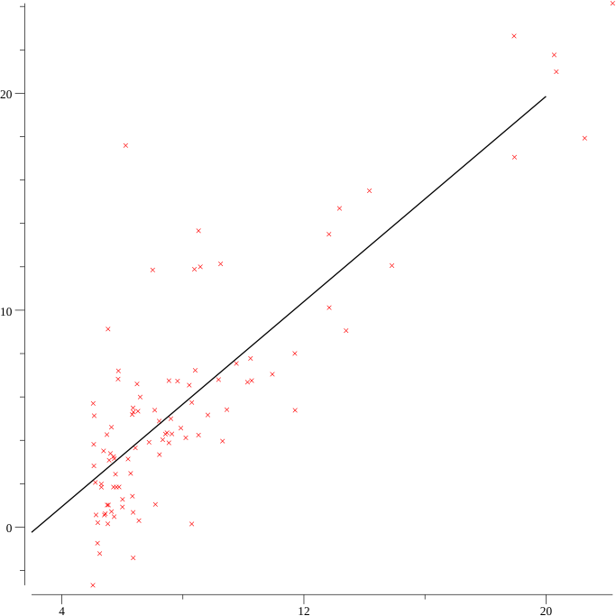

# GO ML (Machine Learning)

In this repo, I explore machine learning, reading + plotting data and other stuff. Here is a graph generated by gonum/v1/plot:

## Resources

- https://www.gonum.org/
- https://www.youtube.com/watch?v=ihP7lQivA6M
